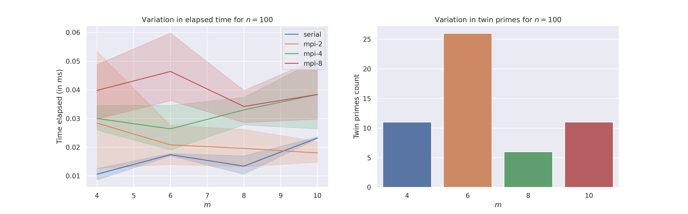
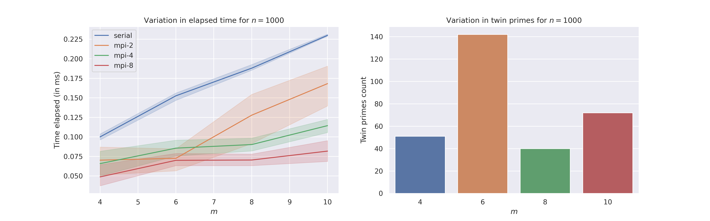
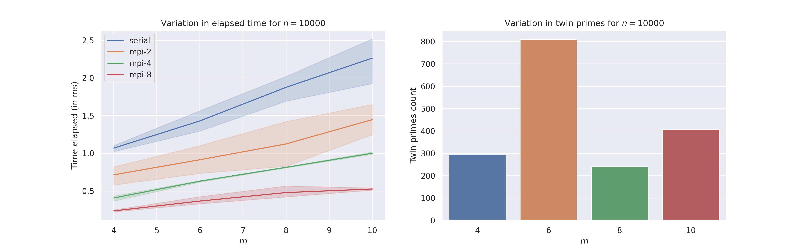
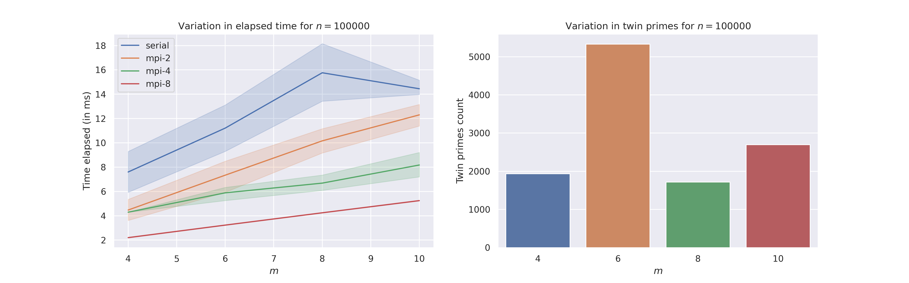
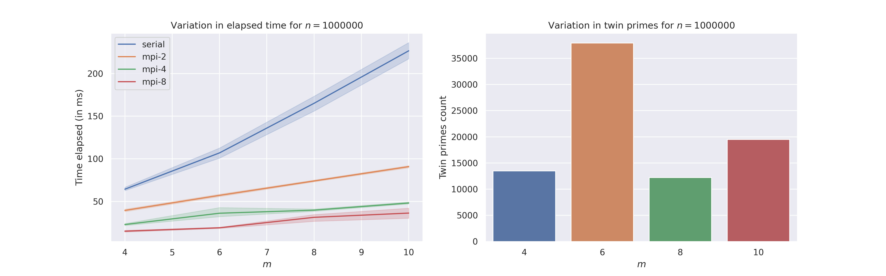
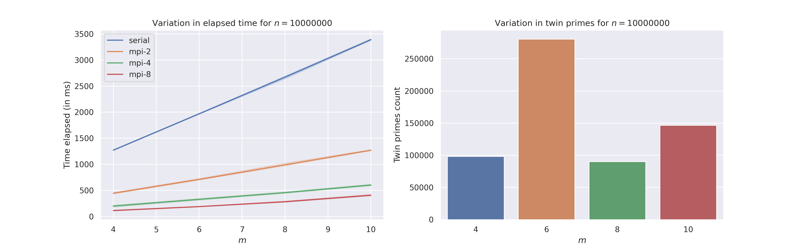
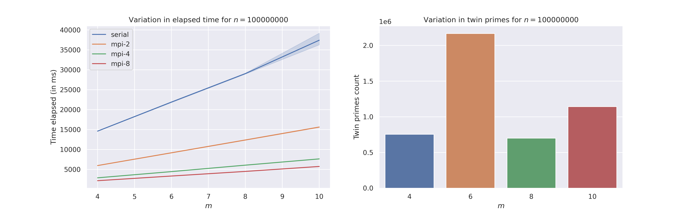

# Twin Prime Generation using Sieve of Eratosthenes

### CS61064 - High Perfomance Parallel Programming - MPI Assignment

#### Utkarsh Patel (18EC35034)

## Block Distribution Scheme

Let's assume we have $N$ numbers for the primality test.
It is known that if we know about the primality test result of first $\sqrt{N}$ numbers, it is very easy to predict whether the rest numbers are prime or not.

This task can be parallelized using MPI as follows:
- Let $S = \sqrt{N}$, and there are $P$ processes in MPI.
- Each process will compute the primality test for the first $S$ numbers locally.
- The remaining $N - S$ numbers are distributed equally among the $P$ processes.
- Let $F_i$ and $L_i$ be the first and the last number in the block for process $P_i$.
    - $B = (N - S) / P$
    - $F_i = S + rank * B$ (here $rank$ is the rank of the process in MPI)
    - $L_i = F_i + B$
- As each process already has its local primality test result of numbers $1$, $2$, ..., $S$, it can use that result to predict whether the number $K$ ($F_i \le K \le L_i$) is prime or not locally.
- Then, it can count twin primes in its local block.
- As the computation for the first $S$ number is done by all the processes, twin primes in this range can then be left to process with $rank = 0$.
- Then, we can use `MPI_Reduce` to get the total number of twin primes.

## Performance Profiling

We vary number of processors $P$, seed $m$, and $n$ (bound on $k$) to generate twin primes $mk-1$ and $mk+1$. See [this](benchmark.ipynb) for building and executing the programs.

We can observe that for high $n$ (bound on $k$), the execution time decreases significantly if we are using MPI with more number of processes $P$.

